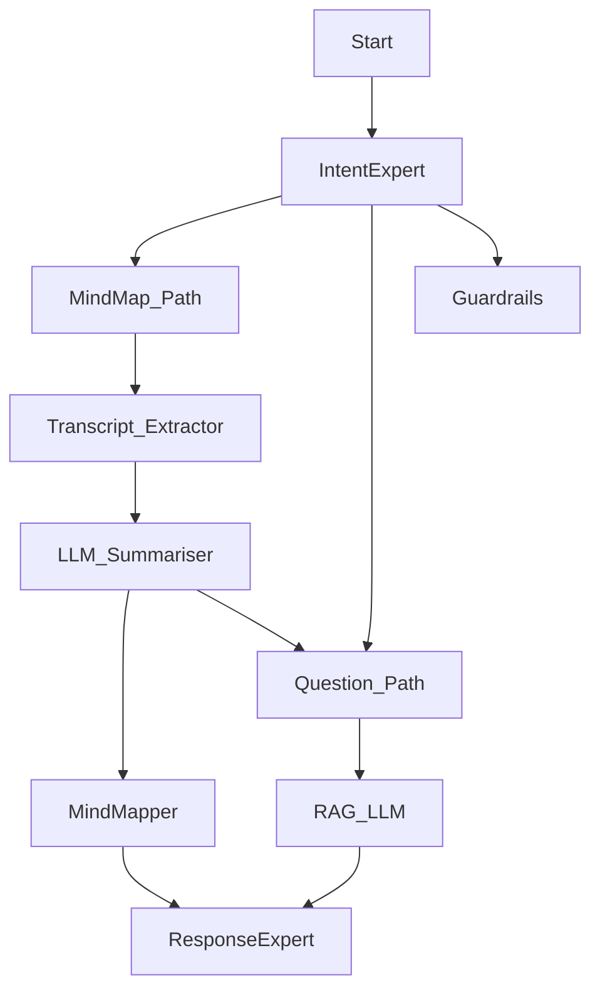

Requirements List:
- Create new mindmap
  - Check URL
  - Ask user to provide name of mindmap
- Generate question from existing mindmap
  - Check if there is existing mindmap
  - Ask which mindmap to sample question from

Agentic Flow - Directed Acyclic Graph (DAG):  
We begin by traversing the node from 'Start', and will only activate the next list of required nodes  once all pre-requisite nodes have been satisfied.
Once the end is reached, then the process is complete.

