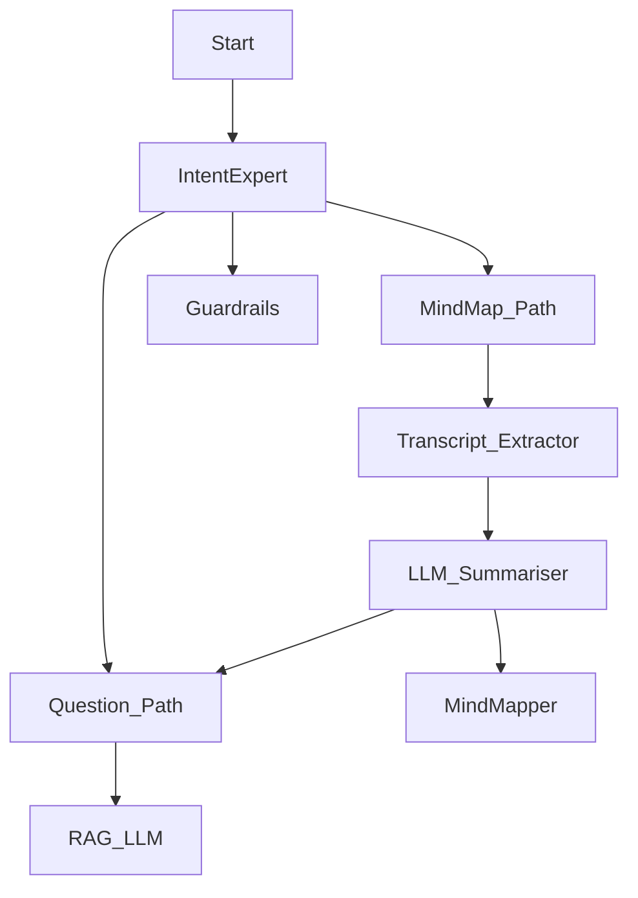

Requirements List:
- Create new mindmap
  - Check URL
  - Ask user to provide name of mindmap
- Generate question from existing mindmap
  - Check if there is existing mindmap
  - Ask which mindmap to sample question from

Flow Chart:

